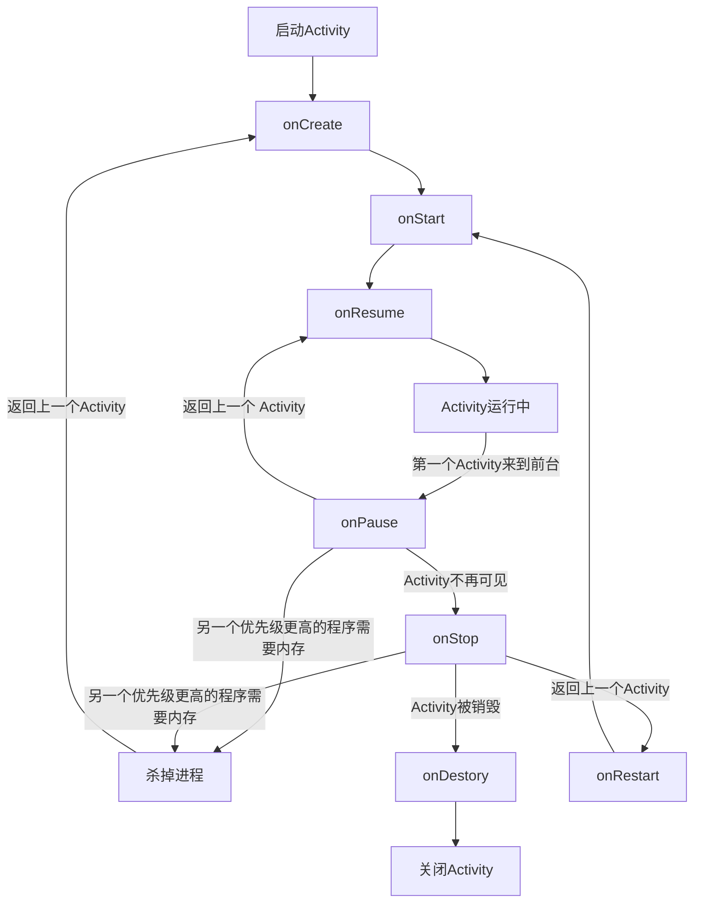

# Activity

```kotlin
class DemoActivity : AppCompatActivity() {
    
    override fun onCreate(savedInstanceState: Bundle?) {
        // 调用父类的 onCreate() 方法，默认实现
        super.onCreate(savedInstanceState)
    }
    
}
```

## 逻辑与视图分离


## 销毁一个 Activity

```kotlin
finish()
```

## Activity 生命周期

掌握 Activity 生命周期十分重要。

### Activity 状态

每个 Activity 在其生命周期中最多有 4 中状态。

1. 运行状态

   当一个

2. 暂停状态

3. 停止状态

4. 销毁状态

### Activity 生存期




